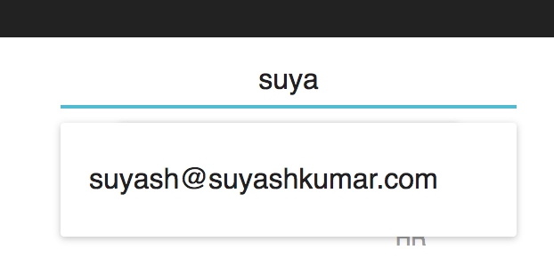
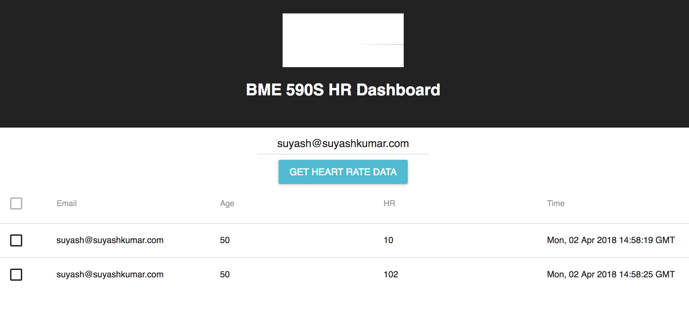

# doctor-hr-frontend (Basic Heart Rate Viewer)

This React project creates a frontend to view heart rate data stored in the cloud as part of [this project](https://github.com/vertikoff/heart_rate_databases_introduction).
Users can select the email address of the patient they would like to see the heart rate reading history of. 
All heart rate readings for that user are then fetched from the cloud and displayed in a table. 

## Running the app
To run this React app, simply run the following command from the root level of this repository:  
1) `npm install`  
2) `npm run start`

## Screenshots
The auto complete email selector:   
  

The dashboard displaying a given user's heart rate readings:  

